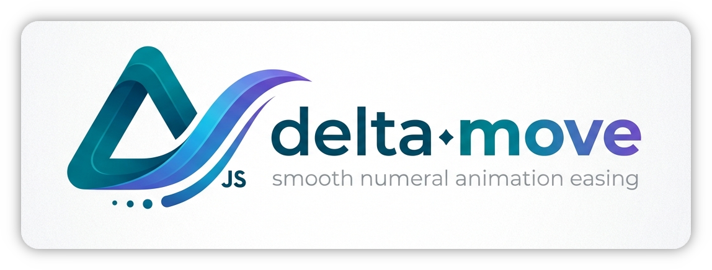

<p align="center">
    <a href="https://github.com/ECRomaneli/delta-move"></a>
</p>
<p align="center">
    Lightweight, zero-dependency animation library with 30 built-in easing effects.
</p>
<p align="center">
    <a href="https://www.npmjs.com/package/delta-move"></a>
    <a href="https://github.com/ECRomaneli/delta-move/commits/master"></a>
    <a href="https://github.com/ECRomaneli/delta-move/blob/master/LICENSE"></a>
    <a href="https://github.com/ECRomaneli/delta-move/blob/master/CONTRIBUTING.md"></a>
</p>

## Features

- **Zero dependencies** — no external runtime dependencies
- **Tiny** — minified UMD bundle under 4 KB
- **30 easing effects** — from linear to elastic, bounce, back, and more
- **Promise-based** — `async/await` friendly
- **Cancellable** — cancel by ID, replace running animations, or cancel all
- **FPS limiting** — optional frame rate cap
- **TypeScript** — full type definitions included
- **Universal** — works in Node.js (with `requestAnimationFrame` polyfill) and browsers

## Installation

### npm

Use [npm](https://www.npmjs.com/package/delta-move) to install the package:

```sh
npm install delta-move
```

### CDN / Browser

Download `delta-move.min.js` from the [latest GitHub Release](https://github.com/ECRomaneli/delta-move/releases/latest) or use it directly via script tag:

```html
<script src="delta-move.min.js"></script>
```

When loaded via `<script>`, the global `DeltaMove` class is available immediately.

## Quick Start

### ES Modules / TypeScript

```ts
import DeltaMove from 'delta-move';

DeltaMove.animate((value) => {
  element.style.opacity = String(value);
}, { duration: 500, range: [0, 1], effect: 'ease-out' });
```

### CommonJS

```js
const DeltaMove = require('delta-move').default;

DeltaMove.animate((value) => {
  element.style.left = value + 'px';
}, { duration: 300, range: [0, 200] });
```

### Browser (UMD)

```html
<script src="delta-move.min.js"></script>
<script>
  DeltaMove.animate((value) => {
    element.style.transform = 'translateX(' + value + 'px)';
  }, { duration: 600, range: [0, 300], effect: 'ease-out-bounce' });
</script>
```

## API

### `DeltaMove.animate(callback, options?)`

Starts an animation and returns a `Promise<void>` that resolves when the animation completes.

**Parameters:**

| Parameter | Type | Description |
|-----------|------|-------------|
| `callback` | `(value: number) => void` | Called on each frame with the current interpolated value. |
| `options` | `AnimationOptions` | Optional configuration object. |

**`AnimationOptions`:**

| Property | Type | Default | Description |
|----------|------|---------|-------------|
| `id` | `string` | — | Unique identifier. Starting a new animation with the same ID automatically cancels the previous one with reason `'replaced'`. |
| `effect` | `EasingEffect` | `'ease-in-out'` | Easing function name (see [Easing Effects](#easing-effects)). |
| `duration` | `number` | `300` | Animation duration in milliseconds. |
| `range` | `[number, number]` | `[0, 1]` | Start and end values. Supports both increasing and decreasing ranges. |
| `fps` | `number` | — | Optional frame rate cap. When set, skips frames to stay within the limit. |

**Returns:** `Promise<void>` — resolves on completion, rejects with `AnimationCancelledError` on cancellation, or the thrown error if the callback throws.

---

### `DeltaMove.cancel(id, reason?)`

Cancels a running animation by its ID.

| Parameter | Type | Default | Description |
|-----------|------|---------|-------------|
| `id` | `string` | — | The animation ID to cancel. |
| `reason` | `AnimationCancelReason` | `'cancelled'` | Either `'cancelled'` or `'replaced'`. |

---

### `DeltaMove.cancelAll(reason?)`

Cancels all running animations.

| Parameter | Type | Default | Description |
|-----------|------|---------|-------------|
| `reason` | `AnimationCancelReason` | `'cancelled'` | Either `'cancelled'` or `'replaced'`. |

---

### `AnimationCancelledError`

Error thrown when an animation is cancelled. Available as a named export and as `DeltaMove.AnimationCancelledError`.

| Property | Type | Description |
|----------|------|-------------|
| `reason` | `AnimationCancelReason` | `'cancelled'` if explicitly cancelled, `'replaced'` if a new animation with the same ID took over. |

**Importing:**

```ts
// Named export
import DeltaMove, { AnimationCancelledError } from 'delta-move';

// Or via the class
DeltaMove.AnimationCancelledError;
```

**Browser:**

```js
DeltaMove.AnimationCancelledError;
```

## Easing Effects

All 30 built-in easing functions:

| Category | In | Out | In-Out |
|----------|-----|------|--------|
| **Sine** | `ease-in` | `ease-out` | `ease-in-out` |
| **Quad** | `ease-in-quad` | `ease-out-quad` | `ease-in-out-quad` |
| **Cubic** | `ease-in-cubic` | `ease-out-cubic` | `ease-in-out-cubic` |
| **Quart** | `ease-in-quart` | `ease-out-quart` | `ease-in-out-quart` |
| **Expo** | `ease-in-expo` | `ease-out-expo` | `ease-in-out-expo` |
| **Circ** | `ease-in-circ` | `ease-out-circ` | `ease-in-out-circ` |
| **Back** | `ease-in-back` | `ease-out-back` | `ease-in-out-back` |
| **Elastic** | `ease-in-elastic` | `ease-out-elastic` | `ease-in-out-elastic` |
| **Bounce** | `ease-in-bounce` | `ease-out-bounce` | `ease-in-out-bounce` |
| **Linear** | | `linear` | |

## Examples

### Smooth scroll

```ts
DeltaMove.animate((y) => {
  window.scrollTo(0, y);
}, { duration: 800, range: [window.scrollY, targetY], effect: 'ease-in-out' });
```

### Fade in

```ts
DeltaMove.animate((opacity) => {
  el.style.opacity = String(opacity);
}, { duration: 400, range: [0, 1], effect: 'ease-out' });
```

### Cancellable animation with ID

```ts
// Start — any previous 'slide' animation is automatically replaced
DeltaMove.animate((x) => {
  el.style.transform = `translateX(${x}px)`;
}, { id: 'slide', duration: 500, range: [0, 300], effect: 'ease-out-back' });

// Cancel manually
DeltaMove.cancel('slide');
```

### Handling cancellation

```ts
try {
  await DeltaMove.animate((v) => { /* ... */ }, { id: 'my-anim', duration: 1000 });
  console.log('Animation completed');
} catch (err) {
  if (err instanceof AnimationCancelledError) {
    console.log('Animation was', err.reason); // 'cancelled' or 'replaced'
  } else {
    throw err;
  }
}
```

### FPS-limited animation

```ts
DeltaMove.animate((v) => {
  heavyRender(v);
}, { duration: 2000, range: [0, 100], fps: 30 });
```

## Author

[ECRomaneli](https://github.com/ECRomaneli)

## License

[MIT](LICENSE)

